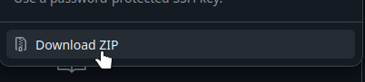
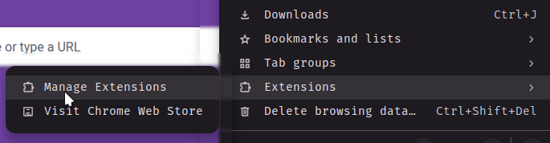
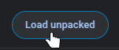
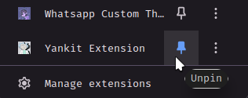
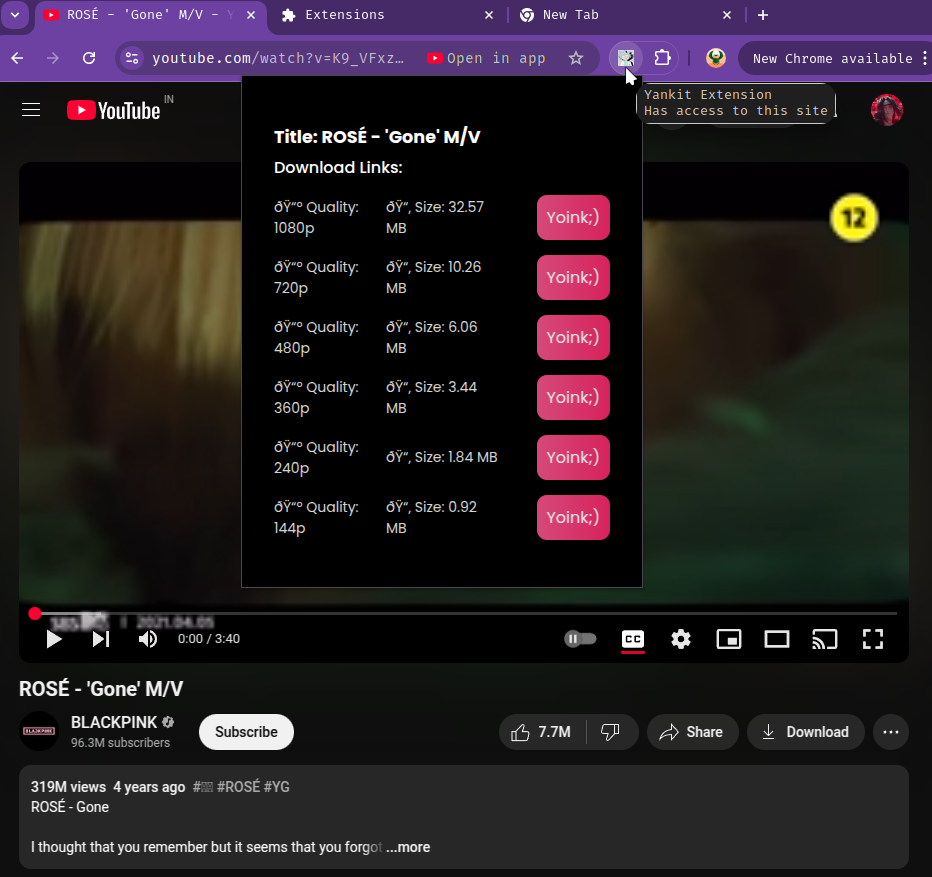

# Yankit Extension 
This is just a browser extension built for [Yankit](https://github.com/Z-Alos/yankit) to make youtube video downloading flow smooth like butter 🧈
So make sure you have installed and running before using this extension else it won't wurk..
Once installed it will automatically start and run in background after boot...

---

## 🚀 Installation
You can just clone the repo if you are familiar to git...Obviously!!!
But if wanna go all vanillar, here you go: 
- #### Click on the Green Looking Code Button on the Page
  
- #### Click on the Download Zip Button
  
- #### Extract the zip you just downloaded, it contains a directory named extension
- #### Open Manage Extension section under the three dots (kebab menu) of your browser 

- #### Enable the Developer mode

- #### Click on Load Unpacked Button

- #### Click on the Extension Button present on top of the browser

- #### Pin the extension for efficient use

- #### Open any video on youtube and hit that extension and you'll be served all the links available 

### 🔗 Some things to keep in mind   
    > ⚙️ Works seamlessly with and only **Chromium-based browsers** like:
    - Google Chrome  
    - Microsoft Edge  
    - Brave  
    *but if you know about browser extension you can modify the **manifest.json** and make it work on any browser 

Adios Amigos
Powering off
~Zalos

